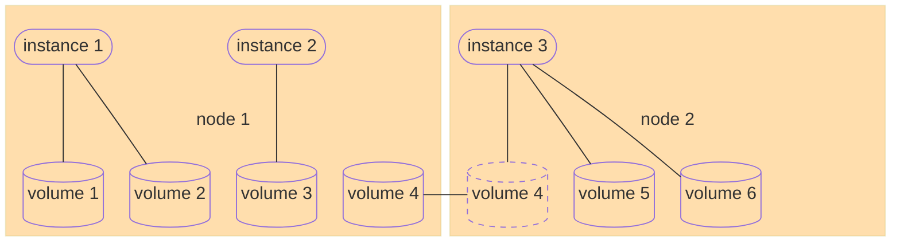
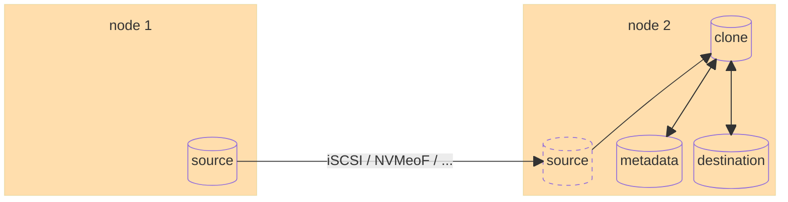
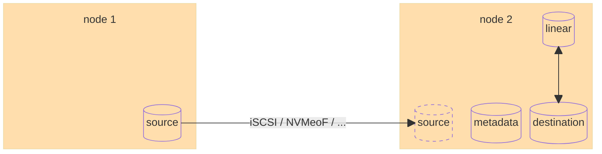
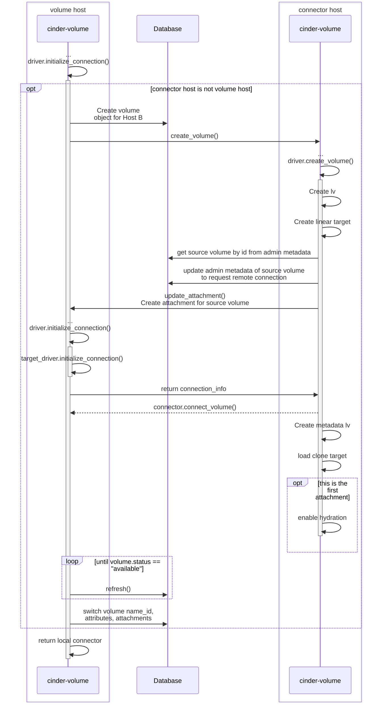
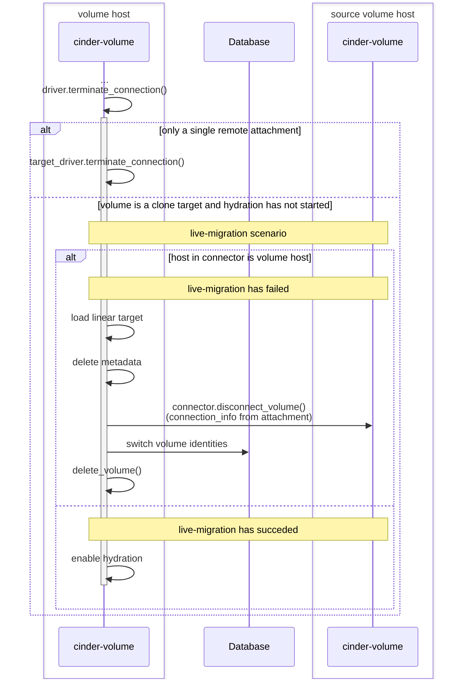
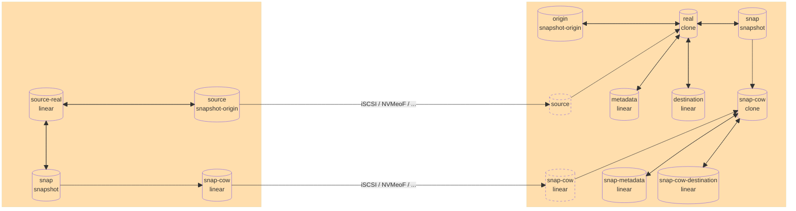
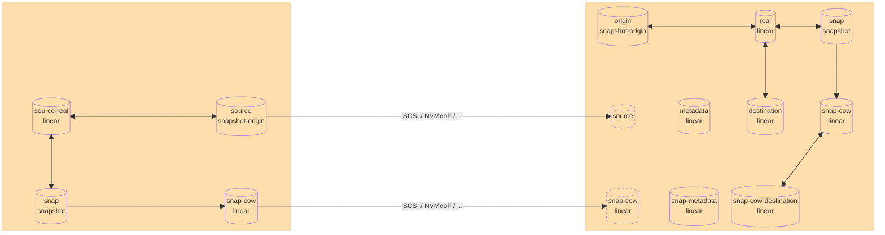

# Cinder driver for transparent usage of local storage

A cinder driver providing local storage through the OpenStack block storage service by transparently migrating volumes to the required node using the Linux kernel's device-mapper dm-clone[^dm_clone] target.

## Usage

> [!IMPORTANT]
> This is a proof of concept. Please read the [Unsolved problems](#unsolved-problems) section below. Expect more problems!

On every hypervisor that should support local storage:
  * Create an `lvm2` volume group
  * Run a cinder volume service
  * Configure a new backend in the volume service
    * Reference the device mapper clone driver: `volume_driver = cinder-driver-dm-clone.cinder.volume.drivers.dmclone.DMCloneVolumeDriver`
    * Use the same `volume_backend_name` everywhere and also use it as the name for the backend section
    * The driver is based on the `lvm` driver and supports its config options. The configured `target_helper` and `target_protcol` will be used to transfer data
    * Reference the volume group created above in `volume_group`
    * E.g.:

      ```ini
      [local-volumes]
      volume_driver = cinder.volume.drivers.dmclone.DMCloneVolumeDriver
      volume_group = local
      volume_backend_name = local-volumes
      target_helper = tgtadm
      target_protocol = iscsi
      lvm_type = default
      ```

## Motivation

Currently there is node local storage in OpenStack in the form of nova ephemeral storage. As its name implies it is ephemeral in the sense that it is bound to the lifecycle of an instance. However, managing compute resources in a cloud native way usually requires storage to be decoupled from compute. Thus, there is a general benefit in making node local storage available in the block storage service.

There are multiple circumstances where node local storage may be desired or required by cloud operators or users.
* When built using open source software it would be a low-cost solution, thus facilitating adoption on small scales, where proprietary or even just dedicated storage solutions would be deemed to expensive.
* While being inherently not highly available above node level, local storage could be useful where IO performance is required and high available storage incurs too much latency through inter-node connections.

## Architecture of an OpenStack cloud with node local storage via block storage service

From a cloud architectural perspective offering node local storage via block storage service requires a volume service on every compute node to manage volumes, so that they may be accessed by local instances. Since many storage volumes may be mapped to one (or possibly more) instances and could be remapped to other instances, a mechanism is needed to transparently migrate storage volumes to the compute node of the instance they are going to be attached to.



Live-migration of instances additionally requires storage volumes to be accessible on both the source and the destination node. However consistent writing from two nodes simultaneously is not a requirement.

## The device-mapper clone target as a migration mechanism for volumes

One possible candidate for transparent storage volume migration is the Linux kernel's device-mapper dm-clone[^dm_clone] target. A device-mapper target which allows to create copies of block devices in the background, while being able to access and use the destination device transparently. The nature of the source device is irrelevant, i.e. it can be a local device or a device accessible via network by any means of transport, thus allowing to clone remote storage volumes.
Setup of a clone target requires a meta data device to keep track of where individual data blocks reside. Initially everything will point to the source device, once a block is copied or written on the destination device the meta data will be updated to point to the new location. This way all writes on the destination device will be local, albeit incurring a slight performance penalty due to the update of the meta data table. The data transferal is kept rather simple, there is no prioritisation of often read blocks and copying will be retried indefinitely until completion. The page cache or other caches will usually alleviate the performance penalty of the former, while the latter allows to complete the migration even after connectivity to the source device was temporarily interrupted.



The process of copying data is called `hydration` in the `dm-clone` targets terminology. The `clone` target may be created with hydration to be started immediately or stopped. Copying may be started and stopped at any time by sending a message to the device-mapper target.
Once the migration is complete the clone target may be replaced by a linear target with a short suspend/resume cycle leading to a small spike in IO latency.



Afterwards the meta data device may be discarded. The connection to the source volume and the source volume itself may be removed as well.
The dm-clone target however lacks a means to specify device offsets. A feature needed to construct complex targets spanning multiple devices as the device-mapper's `linear` target offers and is most prominently used by the `lvm2` project. Therefore, in order to provide the most flexibility, it is proposed to use the `dm-clone` target stacked on top of device-mapper targets provided by `lvm2`. This implies, that after migration a linear target will be stacked on top of the linear `lvm2` target.

### Notes on multi-attachments

Since writes are always handled locally to the node they occur on, no actual multi-attachments can be supported using the device-mapper `clone` target. However, multi-attachments on two nodes for the same instance are a prerequisite for live migration of instances with attached volumes[^live_migration]. In this scenario writes only occur on either the source node or the destination node after successful live migration. With these preconditions it is possible to attach the volume in the described manner on the destination node. The hydration must however only be started once the device is detached on the source, since otherwise writes on the source might be masked on the destination node by blocks which have been transferred before. This implies that hydration may only start once there are no further attachments.
In case of a failed live migration the detachment of the volume on the destination needs to include a clean-up of the created device-mapper targets.

## Failure modes

By definition node local storage is not highly available above node level. Thus, any application making use of this driver needs to be able to either tolerate or mitigate outages. Proper processes need to be in place to restore lost nodes or recover their data if they cannot be restored and data has not been replicated on the application level.

Additional to the common risk of failure while data is at rest on a single node (i.e. not in the process of being migrated), the proposed mechanism introduces failure modes while data is in transit (i.e. during the process of being migrated).
Naturally for a given risk of failure of a single node, the risk is doubled during the time frame of data migration between two nodes. Additionally network partitions or failure may occur, thus increasing the risk further. The overall risk may be reduced by reducing the time frame of migration through increased network bandwidth.
In case of the source being unreachable either by node or network failure, data may not be read leading to read IO errors on the destination node, which will be further handled by the filesystem in use. According to the [dm-clone documentation](https://docs.kernel.org/admin-guide/device-mapper/dm-clone.html) it will try to transfer data indefinitely, so the situation can be fixed by re-exposing the source and remounting the filesystem on the user side.
Failure of or on the destination node will naturally lead to immediate unavailability of the data and potentially also of its consuming workload. Recovery includes detection of volumes with in-progress migrations. This could be done by tracking migration state externally or simply by checking for the existence of meta data volumes. Reconstruction of the clone target could then be done by connecting the corresponding source and re-creating the device-mapper clone target. Once hydration is re-enabled the migration process will continue.

## Security impact

A cinder-volume service is required on each compute node. The service requires access to the cinder database, thus requiring database credentials to be stored on the compute node.

## Concept of key volume driver actions

When initializing a connection from a different host than the one the requested volume resides on, the volume needs to be tranfered. The used mechanism is modeled similar to how cinder implements volume migrations

* A new volume is created via RPC to the volume service on the host the connection is made from, based on a device mapper clone of the current volume
* After successful creation the volume identities and necessary attributes are switched using the `_name_id` property
* A local connector is returned on behalf of the remote service
* A periodic job on each volume service checks all volumes which are in the process of being hydrated, switches those to a linear device mapper target which are finished and cleans up the source volume

Since RPCs are limited in the information they can transfer another channel is required to convey things like, e.g. the source of a device mapper clone. For this volume admin metadata is used.

### Initializing connections

The `initialize_connection()` method needs to do three distinct things

* Return a remote connector if requested through admin metadata using the configured target driver (required by e.g. connecting the source of a clone target, host-assisted volume migration,...)
* Return a local connector should the connector indicate a connection from the same host as the volume
* Transfer the volume as described above and return a local connector



> [!NOTE]
> An alternative implementation could move the logic to setup the device mapper clone target from `create_volume()` to `initialize_connection()` which would then be proxied from the volume service on the source to the destination.
> This would require to reconcile the expected target in the "local" branch of `initialize_connection()`

### Terminating connections

Terminating a connection to a local device usually requires no further actions. However, for this driver there are situations which need actions triggered during connection termination:

* The remote connection of a source volume needs to be terminated correctly by the appropriate target driver
* For failed instance live-migrations a clean up of the created volume and clone target is required
* For successful instance live-migrations the hydration of the destination volume needs to be enabled




### Snapshot support

> [!NOTE]
> Support for snapshots has **not** yet been implemented! The concept has only been tested manually

The Linux device mapper supports snapshot targets, which are used by e.g. `lvm2` to implement volume snapshots[^dm_snapshot]. In order to create a snapshot the target is replaced by a `snapshot-origin` target, which references a newly created origin target which uses the table of the original target and the suffix "-real". An actual snapshot then consist of a `linear` copy-on-write (COW) target with the suffix "-cow" and a `snapshot` target which references the COW target and the origin target. Any write will now trigger a copy-on-write action which wil save the original data in the COW target. A revert to the snapshot may then be triggered by replacing the `snapshot-origin` target with a `snapshot-merge` which references the origin target and the COW target. The `snapshot-merge` will then merge the snapshot data back into the origin target and defer reads to either the snapshot or the origin while doing so. Once all data is merged the `snapshot-merge` may be replaced by the origin table again.
This implies that the COW device needs to be available for every write or otherwise the snapshot will not reflect the state at the time it was taken and thus be considered corrupted.
This means that for the purpose of this driver the snapshot COW target needs to be available on the destination host. Additionally for writes to the destination target to be considered local all writes to any snapshot COW targets need to be local because they would otherwise incur additional latencies during copy-on-write IO. Therefore, when transfering a volume to another host all COW targets need to be cloned to the destination host in the same way the volume itself is cloned. The remaining targets of a snapshot are stateless and may be recreated on the destination host.



After the transfer of all data is done the device mapper clone targets of snapshot COW targets may be replaced by a `linear` target as it is done when transfering bare volumes without snapshots. Afterwards their metadata devices and the connection to their source may be removed as well as the snapshot on the source host.



## Unsolved problems

* The nova scheduler is unaware of the available space on a host, which may lead to instances repeatedly not being able to be created/migrated
  * A scheduler filter could alleviate this problem by taking available space into account
* A volume is not attachable if it exceeds the available space on the instance's host. The error will not be transparently communicated to the user
  * This can only be mitigated on an operational level
    * Disk space needs to be monitored and extended or instances moved once a threshold is reached
    * Volume size for this driver could be limited (currently `per_volume_gigabytes` is not available per volume type though)
* Most volume actions will fail without transparent communication to the user while a volume is being hydrated
  * E.g.:
    * Attaching the volume on another host (e.g. after attachment and detachment to/from another instance), unless chaining of multiple clone targets would be allowed
    * Extending a volume while it is being hydrated (device mapper clone target does not allow this)
    * live-migration (means any instance which just attached a volume cannot be live-migrated)
    * ...
  * Setting the volume to `maintenance` after attachment until hydration finishes might be a compromise
    * Cinder does not support to do this from inside the driver
    * Detachment would not be allowed (expectation is that detachment is always possible, e.g. server rebuild)
  * Currently volume is set to `maintenance` on first unsupported action

# References

[^dm_clone]: https://docs.kernel.org/admin-guide/device-mapper/dm-clone.html
[^live_migration]: https://specs.openstack.org/openstack/nova-specs/specs/pike/approved/cinder-new-attach-apis.html
[^dm_snapshot]: https://docs.kernel.org/admin-guide/device-mapper/snapshot.html
